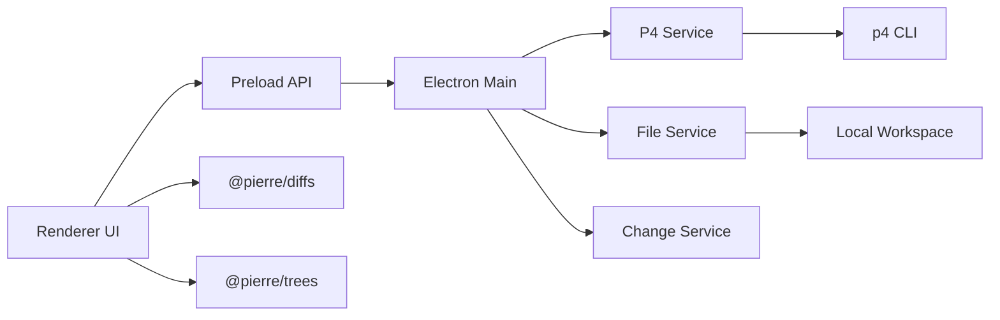

# MyCodeDiff 设计文档

## 1. 已确认设计决策

- 桌面技术栈：Electron + React + TypeScript + Vite + Bun。
- 第一版只保证 Windows。
- P4 环境使用当前系统默认环境，不在应用内配置 `P4PORT`、`P4USER`、`P4CLIENT`。
- Pending 页面只显示当前 workspace/client 下的 pending CL。
- History 页面默认显示当前 workspace 对应 depot 路径范围内的 submitted CL。
- History 页面默认加载最近 50 条 submitted CL。
- Shelved CL 第一版不支持，只保留后续扩展点。
- 语法高亮完全交给 `@pierre/diffs`。
- Diff 计算和 unified/side-by-side 渲染使用 `@pierre/diffs` 的完整能力。
- 文件树构建和展示使用 `@pierre/trees` 的完整能力。
- 第一版不支持文件路径搜索。
- 第一版不支持导出 HTML、Markdown 或文本报告。
- 文件 diff 按点击懒加载。
- 单文件超过 2 MB 时提示确认。
- 单个 CL 超过 500 个文件时提示大 CL。

## 2. 设计目标

MyCodeDiff 第一版是一个本地 Windows 桌面应用，用于查看 P4 Pending 和 History 两类 changelist。

设计重点：

- MyCodeDiff 不自研 diff 渲染器。
- MyCodeDiff 不自研文件树渲染器。
- P4 数据获取、CL 列表、页面状态、配置管理由 MyCodeDiff 负责。
- Diff 展示交给 `@pierre/diffs`。
- 文件树展示交给 `@pierre/trees`.
- P4 命令调用集中封装，便于测试和替换。

## 3. 技术栈

### 3.1 桌面和前端

- Electron
- React
- TypeScript
- Vite
- Bun

### 3.2 核心依赖

```bash
bun i @pierre/diffs @pierre/trees
```

职责划分：

- `@pierre/diffs`：负责 diff 计算、代码渲染、语法高亮、主题、unified 布局、side-by-side 布局。
- `@pierre/trees`：负责文件树构建、层级结构展示、展开折叠等树 UI 能力。

MyCodeDiff 只做轻量封装，不绕过这两个库另写主路径。

## 4. 总体架构



### 4.1 分层

- `renderer`：Pending/History 页面、CL 列表、工具栏、状态显示。
- `preload`：暴露受控 IPC API。
- `main`：协调 P4 命令、本地文件读取、配置读取。
- `p4Service`：封装所有 `p4` 命令调用和输出解析。
- `fileService`：封装本地文件读取、编码处理、大文件检测。
- `changeService`：把 P4 文件信息转换成 UI 可消费的 changelist/file 模型。
- `PierreDiffView`：对 `@pierre/diffs` 的薄封装。
- `PierreTreeView`：对 `@pierre/trees` 的薄封装。

## 5. 目录结构

```text
src/
  main/
    index.ts
    ipc.ts
    services/
      p4Service.ts
      fileService.ts
      changeService.ts
      configService.ts
  preload/
    index.ts
  renderer/
    App.tsx
    pages/
      PendingPage.tsx
      HistoryPage.tsx
    components/
      AppTabs.tsx
      ChangelistList.tsx
      ChangeHeader.tsx
      PierreTreeView.tsx
      DiffToolbar.tsx
      PierreDiffView.tsx
      StatusBar.tsx
    state/
      changeStore.ts
    styles/
      app.css
  core/
    p4/
      p4Types.ts
      p4Parsers.ts
    models/
      changeModels.ts
      configModel.ts
```

## 6. 核心数据模型

### 6.1 Changelist 类型

```ts
type ChangeKind = "pending" | "submitted";

type ChangelistListItem = {
  id: string;
  kind: ChangeKind;
  author?: string;
  client?: string;
  date?: string;
  description?: string;
  fileCount?: number;
};

type ChangelistSummary = {
  id: string;
  kind: ChangeKind;
  author?: string;
  client?: string;
  status?: string;
  description?: string;
  files: ChangeFile[];
};
```

第一版不把 `shelved` 纳入 `ChangeKind` 主流程。

### 6.2 文件变更

```ts
type FileChangeStatus =
  | "added"
  | "deleted"
  | "modified"
  | "unchanged"
  | "renamed"
  | "moved"
  | "binary"
  | "unknown";

type ChangeFile = {
  depotPath: string;
  localPath?: string;
  action?: string;
  oldRev?: string;
  newRev?: string;
  status: FileChangeStatus;
  isText?: boolean;
  sizeBytes?: number;
};
```

### 6.3 文件内容对

```ts
type FileContentPair = {
  file: ChangeFile;
  leftLabel: string;
  rightLabel: string;
  leftText: string | null;
  rightText: string | null;
};
```

规则：

- 左侧表示基准版本。
- 右侧表示目标版本。
- 新增文件左侧为空。
- 删除文件右侧为空。
- 二进制文件不进入文本 diff。
- `FileContentPair` 直接传给 `@pierre/diffs` 封装组件。

## 7. P4 数据读取设计

### 7.1 基础原则

- 所有 P4 调用只出现在 `p4Service` 内。
- 使用当前系统默认 P4 环境。
- 优先使用机器可解析输出，例如 `p4 -ztag`。
- P4 命令失败时保留 stderr，并返回结构化错误。
- Renderer 不直接执行命令。

### 7.2 环境检测

启动或首次加载时执行：

```bash
p4 info
```

用于确认：

- `p4` 是否存在。
- 当前用户是否已登录。
- 当前 client/workspace 是否有效。

### 7.3 Pending 页面

目标：查看当前 workspace/client 下的 pending CL。

候选命令：

```bash
p4 changes -s pending -c <client>
p4 opened -c <cl>
p4 where <depotPath>
p4 print -q <depotPath>#have
```

读取策略：

- 通过 `p4 info` 获取当前 client。
- 使用当前 client 查询 pending CL。
- 使用 `p4 opened -c <cl>` 获取文件列表和 action。
- 使用 `p4 where` 映射 depot path 到 local path。
- `edit` 文件：左侧读取 depot have revision，右侧读取本地文件。
- `add` 文件：左侧为空，右侧读取本地文件。
- `delete` 文件：左侧读取 depot have revision，右侧为空。

实现阶段需要验证：

- `#have` 是否覆盖当前 P4 工作流。
- move/rename 在当前 P4 环境里的输出格式。
- 本地文件缺失或未同步时的错误显示。

### 7.4 History 页面

目标：查看当前 workspace 对应 depot 路径范围内最近 50 条 submitted CL。

候选命令：

```bash
p4 client -o
p4 changes -s submitted -m 50 <depotPath>/...
p4 describe <cl>
p4 print -q <depotPath>#<oldRev>
p4 print -q <depotPath>#<newRev>
```

读取策略：

- 使用 `p4 client -o` 读取当前 client view。
- 从 client view 推导默认 depot path 范围。
- 使用 `p4 changes -s submitted -m 50 <depotPath>/...` 获取历史 CL。
- 使用 `p4 describe <cl>` 获取某个 submitted CL 的文件列表和 revision。
- `edit` 文件：左侧读取提交前 revision，右侧读取提交后 revision。
- `add` 文件：左侧为空，右侧读取新增 revision。
- `delete` 文件：左侧读取删除前 revision，右侧为空。

实现阶段需要验证：

- client view 多条映射时默认 depot path 的选择规则。
- `describe` 输出中的 revision 是否足够推导 old/new。
- integrate、branch、move/delete 等复杂 action 的版本关系。

### 7.5 Shelved CL

第一版不支持 Shelved CL。

设计保留点：

- 后续可以扩展 `ChangeKind`。
- 后续可以新增 Shelved 页面，或把 shelved CL 合并到 Pending 页面。
- 后续再验证 shelved 文件内容读取方式。

## 8. UI 设计

### 8.1 主窗口信息架构

应用包含两个主页面：

- Pending：当前待提交 CL。
- History：已提交历史 CL。

两个页面共享：

- CL 列表。
- 当前 CL 文件树。
- diff 内容区。
- unified/side-by-side 切换。
- 文件状态筛选。

### 8.2 主窗口布局

```text
+-------------------------------------------------------------+
| Pending | History | CL 输入框 | 加载 | Unified | Side | 设置 |
+----------------------+--------------------------------------+
| CL 列表              | Diff 内容                            |
|   CL 123 edit login  |                                      |
|   CL 124 fix cache   | 当前文件路径                         |
|----------------------| @pierre/diffs 渲染区域               |
| 文件树               |                                      |
|   @pierre/trees      |                                      |
+----------------------+--------------------------------------+
| 状态栏：文件数量、差异数量、当前错误或加载状态              |
+-------------------------------------------------------------+
```

### 8.3 Pending Page

页面目标：

- 快速查看当前 workspace/client 下的 pending CL。
- 快速阅读本地修改相对 depot 基准版本的 diff。

交互：

- 刷新 pending CL。
- 选择 pending CL。
- 点击文件查看 diff。
- 切换 unified/side-by-side。
- 按状态筛选文件。

### 8.4 History Page

页面目标：

- 查看当前 client view 范围内最近 50 条 submitted CL。
- 快速打开历史 CL 并阅读提交前后差异。

交互：

- 刷新 history CL。
- 输入 CL 编号直接打开。
- 选择 submitted CL。
- 点击文件查看 diff。
- 切换 unified/side-by-side。
- 按状态筛选文件。

### 8.5 文件树

文件树由 `@pierre/trees` 负责。

MyCodeDiff 提供：

- 文件路径列表。
- 文件状态。
- 文件 action。
- 当前选中文件。
- 点击文件回调。

第一版不支持文件路径搜索。

### 8.6 Diff View

Diff 视图由 `@pierre/diffs` 负责。

MyCodeDiff 提供：

- `leftText`
- `rightText`
- 文件名或扩展名。
- 当前主题。
- diff 布局：unified 或 side-by-side。
- 行号、上下文行、忽略空白等配置。

## 9. IPC API 设计

Renderer 只通过 preload 暴露的 API 访问主进程。

```ts
type MyCodeDiffApi = {
  getP4Environment(): Promise<P4Environment>;
  listPendingChanges(): Promise<ChangelistListItem[]>;
  listHistoryChanges(input: ListHistoryChangesInput): Promise<ChangelistListItem[]>;
  loadChangelist(input: LoadChangelistInput): Promise<ChangelistSummary>;
  loadFileContentPair(input: LoadFileContentPairInput): Promise<FileContentPair>;
  getConfig(): Promise<AppConfig>;
  updateConfig(patch: Partial<AppConfig>): Promise<AppConfig>;
};
```

```ts
type P4Environment = {
  user?: string;
  client?: string;
  root?: string;
  port?: string;
  depotPaths: string[];
};

type ListHistoryChangesInput = {
  depotPath?: string;
  limit: number;
};

type LoadChangelistInput = {
  id: string;
  kind: "pending" | "submitted";
};

type LoadFileContentPairInput = {
  changelistId: string;
  kind: "pending" | "submitted";
  depotPath: string;
};
```

## 10. 配置设计

配置存储在用户本地 app data 目录。

```ts
type AppConfig = {
  p4Path: string;
  defaultPage: "pending" | "history";
  defaultDiffView: "unified" | "side-by-side";
  historyLimit: number;
  contextLines: number;
  ignoreWhitespace: boolean;
  hideUnchanged: boolean;
  showLineNumbers: boolean;
  theme: "system" | "light" | "dark";
  largeFileThresholdBytes: number;
  largeChangeFileCountThreshold: number;
};
```

默认值：

```ts
const defaultConfig = {
  p4Path: "p4",
  defaultPage: "pending",
  defaultDiffView: "side-by-side",
  historyLimit: 50,
  contextLines: 3,
  ignoreWhitespace: false,
  hideUnchanged: false,
  showLineNumbers: true,
  theme: "system",
  largeFileThresholdBytes: 2 * 1024 * 1024,
  largeChangeFileCountThreshold: 500,
};
```

## 11. 错误处理

### 11.1 错误类型

```ts
type AppErrorCode =
  | "P4_NOT_FOUND"
  | "P4_AUTH_REQUIRED"
  | "P4_COMMAND_FAILED"
  | "P4_CLIENT_NOT_FOUND"
  | "CHANGE_NOT_FOUND"
  | "FILE_NOT_FOUND"
  | "BINARY_FILE"
  | "LARGE_FILE_REQUIRES_CONFIRMATION"
  | "LARGE_CHANGE_REQUIRES_CONFIRMATION"
  | "UNSUPPORTED_ACTION"
  | "UNKNOWN";
```

### 11.2 UI 展示

- P4 未安装：提示找不到 `p4` 命令。
- P4 未登录：提示用户在终端执行 `p4 login`。
- CL 加载失败：在主区域显示错误详情。
- 单文件 diff 加载失败：文件树仍可用，diff 区域显示该文件错误。
- 二进制文件：显示“Binary file”，不尝试文本 diff。
- 大文件：提示确认后再读取内容。
- 大 CL：提示文件数量较多，diff 仍按点击懒加载。

## 12. 性能设计

- CL 列表加载时只读取摘要。
- 选择 CL 后只读取文件列表。
- 文件内容点击后再读取。
- 同一文件内容对放入内存缓存。
- 切换 unified/side-by-side 不重新读取 P4，只更新 `@pierre/diffs` 配置。
- 单文件超过 2 MB 时提示确认。
- 单个 CL 超过 500 个文件时提示大 CL。
- 第一版不做复杂虚拟滚动或分块 diff。

## 13. 测试策略

### 13.1 单元测试

重点覆盖：

- P4 输出解析。
- client view depot path 推导。
- pending/history CL 列表解析。
- 文件状态映射。
- `FileContentPair` 生成规则。
- 配置默认值。

### 13.2 集成测试

重点覆盖：

- mock `p4 info` 后读取环境。
- mock `p4 changes -s pending` 后加载 Pending 列表。
- mock `p4 changes -s submitted -m 50` 后加载 History 列表。
- pending add/edit/delete 文件内容对生成。
- submitted add/edit/delete 文件内容对生成。
- 大文件提示。
- 大 CL 提示。

### 13.3 UI 手动验证

第一版手动验证：

- Pending/History 页面切换。
- Pending 列表加载。
- History 列表加载。
- 选择 CL。
- 文件树展示。
- 点击文件。
- unified/side-by-side 切换。
- P4 命令失败时错误展示。

## 14. 实现里程碑

### Milestone 1：项目脚手架

- 建立 Electron + React + TypeScript + Vite 项目。
- 配置 Bun 脚本。
- 安装 `@pierre/diffs` 和 `@pierre/trees`。
- 建立 main/preload/renderer/core 目录。

### Milestone 2：P4 环境和列表

- 封装 `p4` 命令执行。
- 实现 `p4 info` 环境检测。
- 实现当前 client view depot path 推导。
- 实现 Pending CL 列表。
- 实现 History 最近 50 条 CL 列表。

### Milestone 3：CL 和文件内容

- 实现 pending CL 文件列表读取。
- 实现 submitted CL 文件列表读取。
- 实现 pending 文件内容对生成。
- 实现 submitted 文件内容对生成。
- 实现大文件和大 CL 提示逻辑。

### Milestone 4：桌面 UI

- 实现 Pending/History 页面切换。
- 实现 CL 列表。
- 封装 `@pierre/trees` 文件树。
- 封装 `@pierre/diffs` diff 视图。
- 实现加载中、空状态、错误状态。

### Milestone 5：体验完善

- 实现 unified/side-by-side 切换。
- 实现文件状态筛选。
- 实现隐藏未变化文件。
- 实现配置持久化。
- 补齐 Windows 路径和编码处理。

### Milestone 6：后续扩展

- Shelved CL。
- 文件路径搜索。
- 普通目录对比。
- Git diff。
- 导出报告。
- macOS/Linux 支持。
